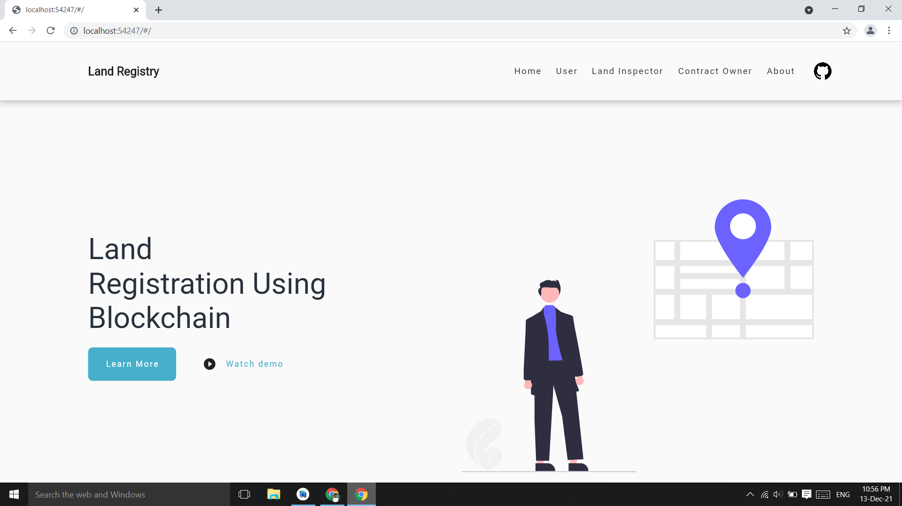
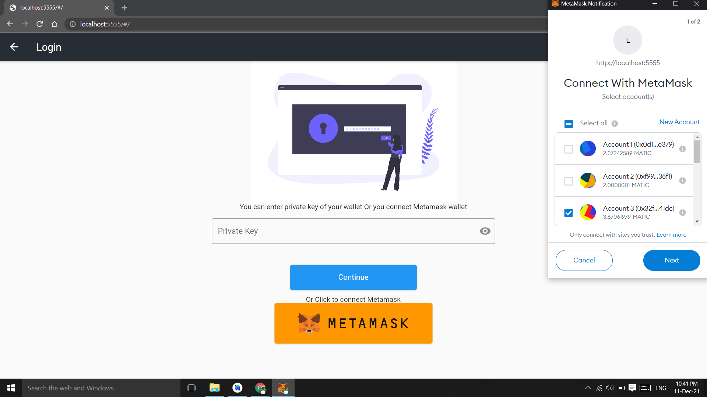
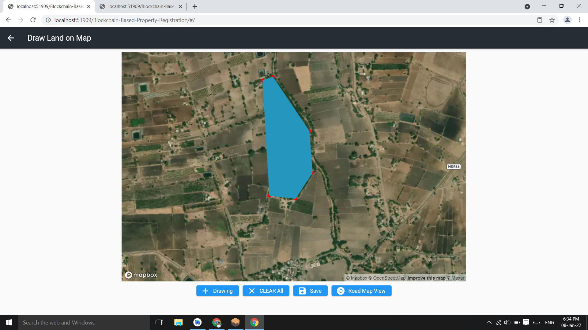
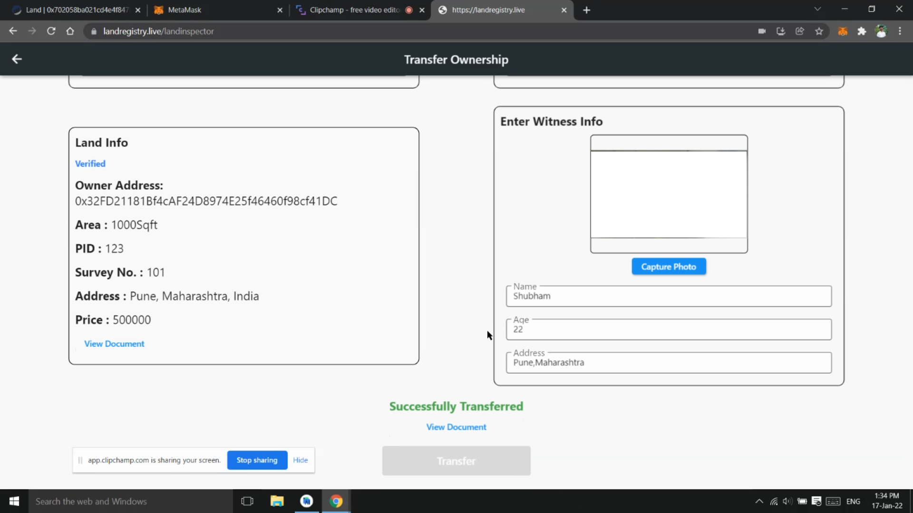
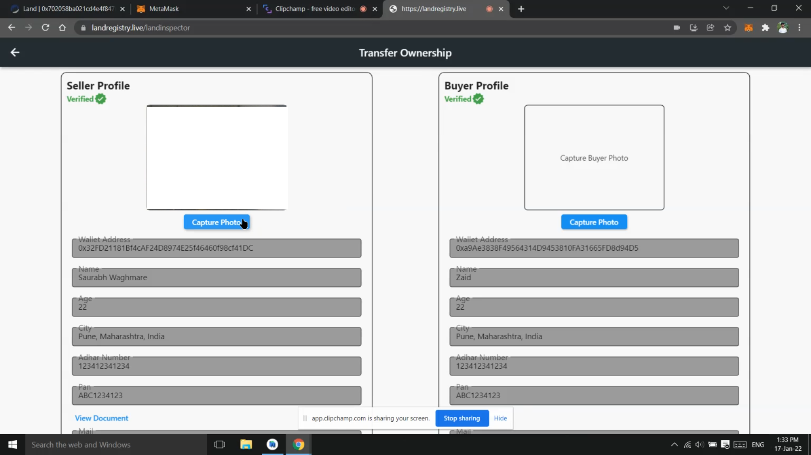

# 🏛️ Land Registration Using Blockchain
A decentralized blockchain-based system for secure and transparent land registration using Ethereum, Solidity, and Flutter.


## 📘 Overview
The **Land Registration Using Blockchain** project is a decentralized web application (DApp) that leverages blockchain technology to ensure **secure, transparent, and tamper-proof property transactions**.  
It eliminates intermediaries and fraudulent activities by recording all ownership and transfer details on an **immutable blockchain ledger**.

This project uses **Ethereum**, **Solidity**, **Truffle**, **Ganache**, **Metamask**, and **Web3.js**, with a **Flutter-based frontend** for user-friendly interaction.

---

## 🎯 Objectives
- 🧾 Develop a decentralized application for property registration and ownership transfer.  
- 🔐 Ensure data security, transparency, and immutability using blockchain.  
- ⚙️ Eliminate middlemen and reduce registration delays.  
- 💸 Facilitate secure peer-to-peer land transactions between buyer and seller.  
- 📜 Automatically generate digitally signed ownership documents.

---

## ⚙️ Features
- 👤 **User Registration & Verification:**  
  Users register using their Ethereum wallet and are verified by a Land Inspector.

- 🏠 **Land Addition & Verification:**  
  Verified users can add land details and supporting documents. Land Inspectors verify and approve them.

- 💰 **Ownership Transfer:**  
  Buyers send purchase requests, sellers accept, and payments are processed securely through smart contracts.

- 📄 **Digital Documentation:**  
  Generates and stores ownership documents digitally after successful transfer.

- 🌐 **Transparency:**  
  All property data is stored on the Ethereum blockchain and visible to verified stakeholders.

---

## 🧩 Tech Stack

| Technology | Purpose |
|-------------|----------|
| **Solidity** | Writing Smart Contracts |
| **Ethereum Blockchain (Ropsten Testnet)** | Decentralized ledger |
| **Truffle Suite** | Smart contract deployment and testing |
| **Ganache** | Local blockchain simulation |
| **Metamask** | Wallet and Ethereum account access |
| **Web3.js** | Connecting frontend with blockchain |
| **IPFS** | Decentralized document storage |
| **Flutter** | Frontend interface for DApp |

---

## 🧠 Workflow

1️⃣ User logs in via Metamask or private key.  
2️⃣ Contract owner adds a Land Inspector.  
3️⃣ User registers and uploads identity proof.  
4️⃣ Land Inspector verifies user details.  
5️⃣ User adds property and document details (drawn on a map).  
6️⃣ Inspector verifies property.  
7️⃣ Buyer sends purchase request → Seller accepts → Payment is done.  
8️⃣ Inspector verifies transaction and transfers ownership.  
9️⃣ Digitally signed ownership document is generated and stored.

---

## 🚀 Steps to Run

### 1️⃣ Clone the repository
```bash
git clone https://github.com/likithashreeh10/Land-Registration-Using-Blockchain.git
cd Land-Registration-Using-Blockchain


2️⃣ Install dependencies
npm install

3️⃣ Run Ganache (local blockchain environment)
4️⃣ Compile and migrate smart contracts
truffle compile
truffle migrate

5️⃣ Run the Flutter DApp
flutter run

6️⃣ Connect Metamask to Ropsten Testnet

Import test ETH from a faucet and start interacting with the DApp.

```

## 🖼️ Screenshots

### 🏠 Homepage


### 🔗 metamask_connection


### 🧾 Draw Land on Map


### 📋 Ownership Transfer Page


### 🧾 Ownership Transfer Document



## 👩‍💻 Author
**Likithashree H**  
🎓 Computer Science & Engineering Student  
🔗 [LinkedIn Profile](https://www.linkedin.com/in/likithashree-h-75a8b8308/)
